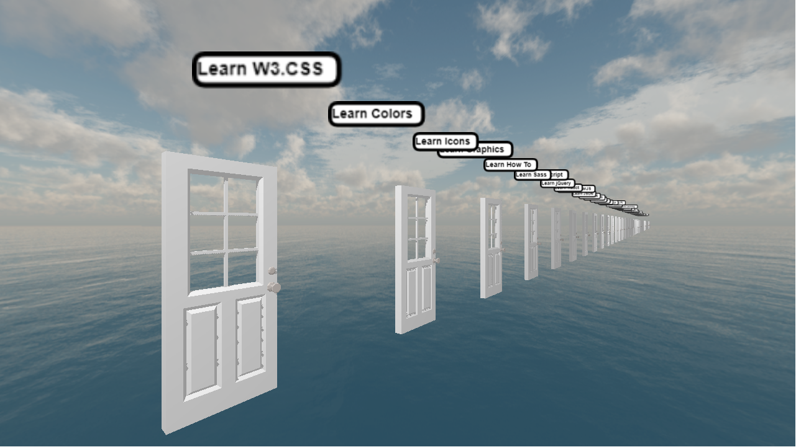

# web_corridor
An online 3D web experience that maps links and contents of any webpage onto corresponding elements in a procedural hotel

## How does it works ?
I'm writing a parser that turns any elements of the provided html source into a usable in-game asset.
For instance, when encountering any <a> element in the DOM, i generate a door next to the objects in the scene,
That is labbeled as the content of the anchor, and has an action set to redirect onto the following linked page.

At some point, the goal is to explore freely corridors generated as you open up doors, when going from page to page. (doors to doors)

### Current Milestones : 
 - anchor <a> support : doors

This project is still WIP !

